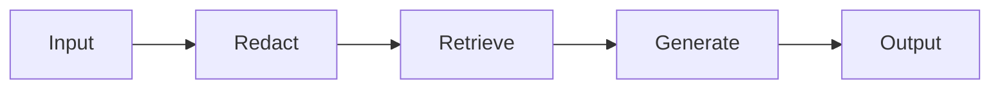

# Model card — <Feature name>

> Lives at `docs/model-cards/<feature>.md`. Updated on every model swap.
> Aligned with EU AI Act Art. 11 technical documentation requirements.

## Feature

Short description. Link to the [behavioral spec](../specs/<feature>.md).

## Intended use

- **Primary use:** Who uses this, for what.
- **In-scope:** What inputs and contexts it's designed for.
- **Out-of-scope:** What inputs / contexts it should not be used for.

## Model

| Field | Value |
|---|---|
| Provider | (e.g. OpenAI, Anthropic, Meta, Mistral) |
| Model id / version | (e.g. `gpt-4o-2024-11-20`) |
| Modality | text / vision / audio / multimodal |
| Context window | (e.g. 128k tokens) |
| Approximate parameter count | (if disclosed) |
| Licensed for commercial use | yes/no |

## Architecture

If applicable, brief description of the AI feature's pipeline:

(Or a 2–4 line text description.)

## Training & fine-tuning

- **Base model trained on:** (cite provider's disclosure)
- **Fine-tuning by us:** (yes/no; if yes, dataset summary, size, time)

## Eval baseline

| Field | Value |
|---|---|
| Last baseline run | YYYY-MM-DD |
| Baseline file | `evals/baselines/<feature>.json` |
| Aggregate score | 0.XX |
| Per-behavior floor breaches | 0 |
| Cost per call | $0.XXXX |
| Latency p95 | XXXX ms |
| Eval dataset | `evals/datasets/<feature>.jsonl` |
| Dataset size | XXX cases |

## Performance characteristics

| Segment | Aggregate | Notes |
|---|---|---|
| en | 0.XX | |
| es | 0.XX | |
| fr | 0.XX | |
| (other) | | |

## Known limitations

(From the spec's `## Known failure modes` section, summarized)

- ...
- ...

## Safety considerations

- **PII handling:** (link to PII threat model)
- **Prompt injection mitigations:** ...
- **Hallucination mitigations:** ...
- **Content policy alignment:** ...

## Human oversight (Art. 14)

- **Escalation triggers:** When does this feature require human review?
- **Decision authority:** Who can approve / reject AI suggestions?
- **Audit log:** What is logged for every AI-influenced decision?

## Transparency (Art. 13)

- **User disclosure:** What does the user see indicating AI is involved?
- **Explanation availability:** Can users request an explanation? (Yes / No / How)

## Maintenance

- **Owner team:** ...
- **On-call rotation:** ...
- **Update cadence:** ...
- **Deprecation policy:** When this card / model is retired, where does the next version live?

## Changelog

| Date | Change | Approver |
|---|---|---|
| YYYY-MM-DD | Initial release | @ |
