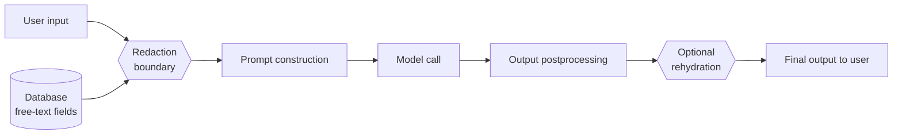

# PII threat model — <Feature name>

> Per HANDBOOK §5. Lives at `docs/threat-models/<feature>-pii.md`.

## Boundary diagram

The boundary is the function `<module>.<build_prompt>`. No path to `<call_model>` exists that does not go through it.

## PII types in scope

For this feature, redact:

- [ ] Email addresses
- [ ] Phone numbers
- [ ] SSN / national ID
- [ ] Credit card numbers
- [ ] IBAN / bank account
- [ ] IP addresses
- [ ] Person names (full names)
- [ ] Person names (first names only)
- [ ] Addresses (full)
- [ ] Addresses (street-only or zip-only)
- [ ] Government IDs (driver's license, passport)
- [ ] Medical record numbers
- [ ] Internal employee IDs
- [ ] Other: ...

## Redactor

- **Library:** (e.g. Microsoft Presidio + custom address detector)
- **Listed in `.claude/hooks/redactors.txt`:** yes/no
- **Tests asserting PII type coverage:** (link)
- **Determinism:** same input → same tokens (required for caching)

## Sources of PII

Trace each path from user-input → prompt:

1. **HTTP request body** — fields: ___ — redactor applied: yes/no
2. **DB read of column X** — text-typed: yes/no — redactor applied: yes/no
3. **Email body intake** — redactor applied: yes/no
4. **User-uploaded file** — redactor applied: yes/no
5. **Vector store retrieval** — redacted at index time: yes/no
6. **Chat history** — redacted at write time: yes/no

Any "no" above is a Rule 03 violation; fix before deploy.

## Residual risks

What can still go wrong even with redaction in place:

- (Honest list — e.g. "OCR'd text from images is not currently redacted.")
- (e.g. "Free-form notes column was historically inconsistent; index has some legacy un-redacted content.")
- (e.g. "Custom PII type X is not in the standard redactor; custom rule added but not stress-tested.")

For each residual risk, mitigation:

- ...

## Logs and observability

- **PII redaction count emitted to logs:** yes/no
- **Per-type breakdown logged:** yes/no
- **Sample re-scan cadence:** (e.g. nightly 1000-prompt sample)
- **Alert threshold:** (e.g. >0.5% PII detected → P1)

## Approver

- Privacy / security: @
- Engineering: @
- Approved on: YYYY-MM-DD
